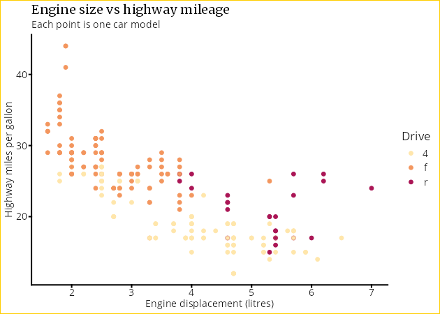
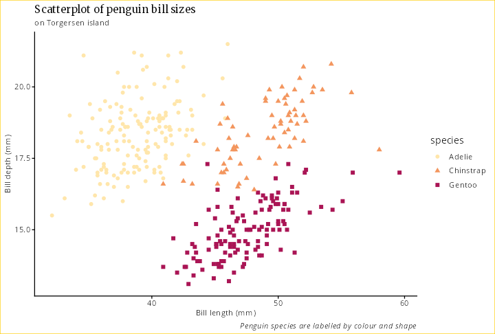

# gguu: University Utrecht ggplot theme

This package provides a theme and colour palette for
[`ggplot`](https://ggplot2.tidyverse.org/) figures in R.
With this, you can make publication-ready figures with colours that match
the Utrecht University corporate identity.

## Contents

- [Installation](#installation)
- [How to use](#how-to-use)
- [Themes](#themes)
- [Colours](#colours)
- [Fonts](#fonts)
- [Version planning](#version-planning)
- [Licence](#licence)
- [Credits](#credits)

## Installation

Install within R using `devtools`:

```R
install.packages("devtools")
require(devtools)
devtools::install_github("https://github.com/UtrechtUniversity/gguu.git")
```

For installing the required fonts, see [below](@fonts).

## How to use

Below is a simple example using data from the `ggplot2` package:

```R
library(ggplot2)
library(gguu)

mpg |>
  ggplot(aes(x = displ, y = hwy, colour = drv)) +
  geom_point(size = 2) +
  labs(
    title = "Engine size vs highway mileage",
    subtitle = "Each point is one car model",
    x = "Engine displacement (litres)",
    y = "Highway miles per gallon",
    colour = "Drive") +
  uu_presentation() + # Use the theme for presentations (line and font sizes for screens)
  scale_colour_uu_d() # Use the discrete colour scale
```



And as a more fun example, here is one with penguins! 🐧🐧

```R
library(palmerpenguins)

penguins |> ggplot(na.omit(.) %>% filter(island == "Biscoe"),
  mapping = aes(
    x = bill_length_mm,
    y = bill_depth_mm,
    color = species, shape = species
  )
) +
  geom_point(size = 2) +
  theme(legend.position = "right") +
  labs(
    x = "Bill length (mm)",
    y = "Bill depth (mm)",
    title = "Scatterplot of penguin bill sizes",
    subtitle = "on Torgersen island",
    caption = "Penguin species are labelled by colour and shape"
  ) +
  uu_publication() +
  scale_colour_uu_d()
```



## Themes

(to do...)

## Colours

Read <https://www.uu.nl/en/organisation/corporate-identity/brand-policy/colour>
for details.

### Main colours

- ${\color{#FFCD00}Yellow = FFCD00}$
- ${\color{#000000}Black = 000000}$
- ${\color{#FFFFFF}White = FFFFFF}$
- ${\color{#C00A35}Red = C00A35}$

Red is used sparingly as additional accent.

### Secondary palette

- ${\color{#FFE6AB}Cream = FFE6AB}$
- ${\color{#F3965E}Orange = F3965E}$
- ${\color{#AA1555}Burgundy = AA1555}$
- ${\color{#6E3B23}Brown = 6E3B23}$
- ${\color{#24A793}Green = 24A793}$
- ${\color{#5287C6}Blue = 5287C6}$
- ${\color{#001240}Dark Blue = 001240}$
- ${\color{#5B2182}Purple = 5B2182}$

These colours may also be used in lighter shades if that fits better with the
data visualisation.

## Fonts

Read <https://www.uu.nl/en/organisation/corporate-identity/brand-policy/fonts> for
details.

The fonts are freely available from Google Fonts.

Titles: [Merriweather](https://fonts.google.com/specimen/Merriweather)
Other text: [Open Sans](https://fonts.google.com/specimen/Open+Sans)
Titles, alternative: [Zilla Slab](https://fonts.google.com/specimen/Zilla+Slab)

## Version planning

- Version 0.1: first working release with simple theme and one colour palette
- Further versions (order of updates to be determined)
  - example figures in README
  - theme adapted for screen, poster and article
  - option for lighter colours
  - proper documentation of all functions
  - extended colour palettes?
  - make installable through CRAN?

## Licence

This project is licensed under the terms of the [BSD 3-Clause License](LICENSE).

## Credits

Thanks to:

- Utrecht University Brand Team for providing the [colours](https://www.uu.nl/en/organisation/corporate-identity/brand-policy/colour) and [fonts](https://www.uu.nl/en/organisation/corporate-identity/brand-policy/fonts)
- Jakob Wirbel, for providing a nice example with [ggembl](https://git.embl.org/grp-zeller/ggembl)
- Yan Holtz, for inspiring me through to start making an R package in the course [Productive R workflow](https://www.productive-r-workflow.com/)
- David Barnett for pointing me in the direction of [devtools](https://devtools.r-lib.org/) to facilitate creating a package with documentation
- Allison Horst for providing the [penguin dataset](https://github.com/allisonhorst/palmerpenguins)
